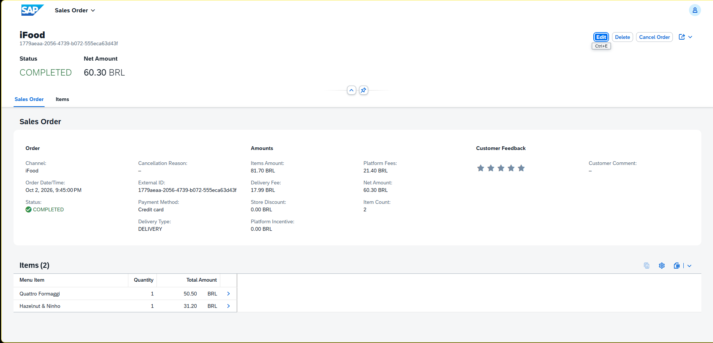
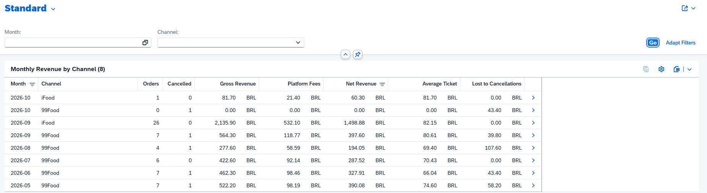
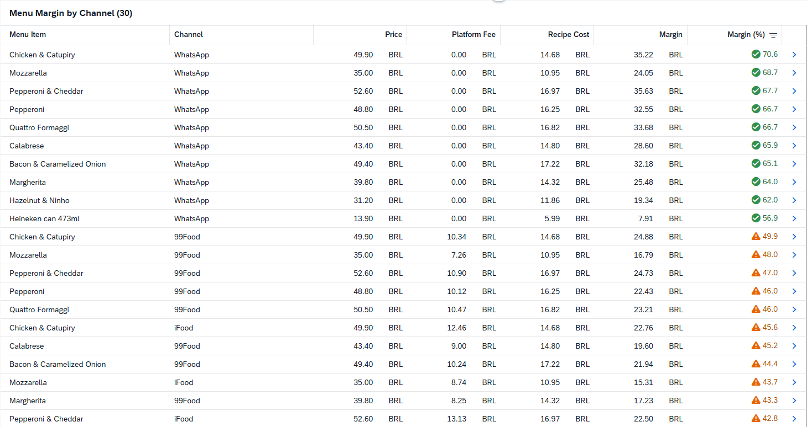
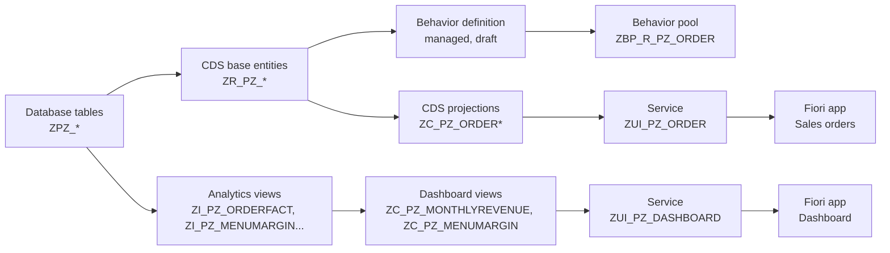
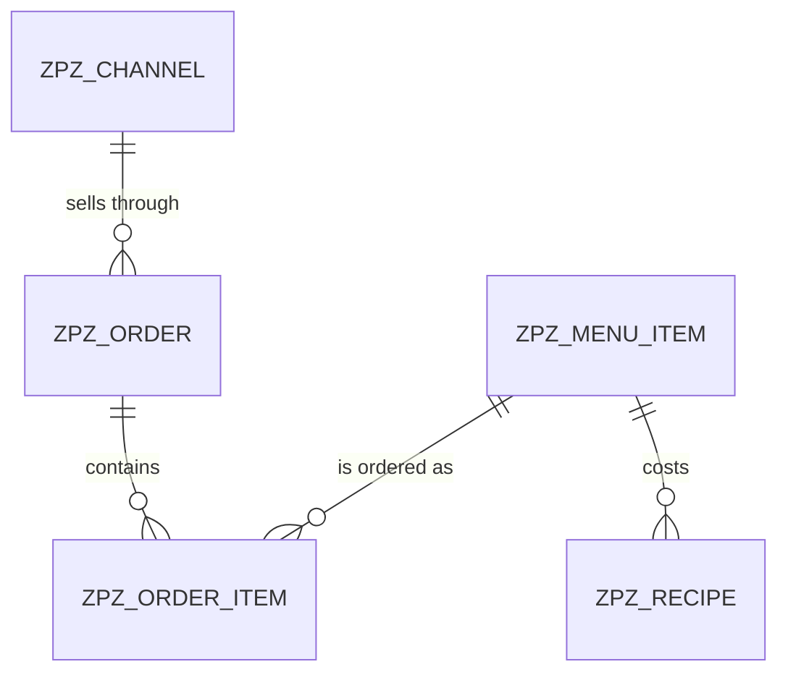

# 🍕 Pizzeria Sales Management — SAP RAP on ABAP Cloud

A sales order management app for a real neighborhood pizzeria in Brazil, built with the
**ABAP RESTful Application Programming Model (RAP)** on the **SAP BTP ABAP Environment**.

The project started as a React + Supabase dashboard that tracks orders from four sales
channels (iFood, 99Food, WhatsApp and in-house consumption), menu prices, recipe costs and
profit margins. This repository rebuilds that system the SAP way: database tables, CDS view
entities, a managed RAP business object with draft, and two OData V4 services consumed by
Fiori elements apps: one to manage sales orders and one dashboard with monthly revenue and
menu margins per channel. The data are the pizzeria's real orders from May to October 2026.

## Screenshots

**Sales order**

**Dashboard**

| Monthly revenue by channel | Menu margin by channel |
|---|---|
|  |  |

## What the data show

- **The sales channel decides the margin.** After the platform fee and the recipe cost, a
  pizza keeps 57–71% of its price when sold through WhatsApp, 36–50% through 99Food and
  32–46% through iFood. Each pizza sold through iFood earns R$ 7.79 to R$ 13.13 less than
  the same pizza sold through WhatsApp.
- **iFood is the main channel since September.** It brought 26 orders and R$ 2,135.90 in
  September, of which R$ 532.10 (24.9%) went to platform fees.
- **Cancellations cost R$ 292.40** in 99Food orders, mostly orders not accepted within
  10 minutes.

## Tech stack

- **ABAP Cloud** (ABAP for Cloud Development, released APIs only)
- **RAP**, managed implementation in strict mode, with UUID numbering, draft, ETags,
  determinations, validations, actions, feature control and side effects
- **CDS view entities**: interface, base and projection layers, plus aggregations
  (`GROUP BY`, `CASE`, `DIVISION`, `TSTMP_TO_DATS`) for the dashboard
- **OData V4** UI services
- **SAP Fiori elements**: list reports and object pages generated from UI annotations
- **SAP BTP ABAP Environment** (trial) with **Eclipse ABAP Development Tools**
- **abapGit** for version control

## Architecture

## Data model

| Table | Purpose | Key |
|---|---|---|
| `ZPZ_CHANNEL` | Sales channels with platform fee % and a flag that tells whether the channel counts as a sale | Semantic (`CHANNEL`) |
| `ZPZ_ORDER` | Sales order header: amounts, fees, payment and delivery data | UUID |
| `ZPZ_ORDER_ITEM` | Sales order items | UUID |
| `ZPZ_MENU_ITEM` | Menu items and prices | Semantic (`MENU_ITEM_ID`) |
| `ZPZ_RECIPE` | Recipe cost components per menu item (dough, sauce, cheese, box...) | Semantic (`MENU_ITEM_ID` + `COMPONENT_NO`) |

## Repository objects

| Object | Type | Description |
|---|---|---|
| `ZPZ_*` | Database tables | Persistence layer |
| `ZPZ_ORDER_D` / `ZPZ_ORDER_ITEM_D` | Database tables | Draft tables for orders and items |
| `ZCL_PZ_DATA_GENERATOR` | Class | Loads the menu, recipe costs and the 63 real iFood and 99Food orders from May to October 2026 (run with F9) |
| `ZR_PZ_ORDER` / `ZR_PZ_ORDERITEM` | CDS view entities | Base layer of the RAP business object (root and child) |
| `ZI_PZ_CHANNEL` / `ZI_PZ_MENUITEM` | CDS view entities | Master data: channel and menu item names, used for texts and value helps |
| `ZR_PZ_ORDER` | Behavior definition | Managed behavior (strict mode) with draft: CRUD, create-by-association, locking, total ETag, determinations, validations, side effects and the *Cancel Order* action |
| `ZBP_R_PZ_ORDER` | Class | Behavior implementation: amount calculations, validations, action and feature control |
| `ZD_PZ_CANCEL_REASON` | Abstract entity | Parameter of the *Cancel Order* action |
| `ZC_PZ_ORDER` / `ZC_PZ_ORDERITEM` | CDS projection views | App-specific layer with UI annotations |
| `ZC_PZ_ORDER` | Behavior definition | Projection behavior |
| `ZUI_PZ_ORDER` | Service definition | Exposes sales orders and items |
| `ZUI_PZ_ORDER_O4` | Service binding | OData V4 UI binding used by the Fiori elements preview |
| `ZI_PZ_ORDERFACT` | CDS view entity | One row per order with the order date and month in Brasilia time |
| `ZI_PZ_MONTHLYREVENUE` | CDS view entity | Orders, cancellations, gross, fees, net and lost revenue per month and channel |
| `ZI_PZ_MENUITEMCOST` | CDS view entity | Recipe cost per menu item |
| `ZI_PZ_MENUMARGIN` | CDS view entity | Price − platform fee − recipe cost for every menu item in every sales channel |
| `ZC_PZ_MONTHLYREVENUE` / `ZC_PZ_MENUMARGIN` | CDS view entities | Dashboard layer: average ticket, margin colors and UI annotations |
| `ZUI_PZ_DASHBOARD` | Service definition | Read-only dashboard service |
| `ZUI_PZ_DASHBOARD_O4` | Service binding | OData V4 UI binding of the dashboard |

### Naming conventions

| Prefix / suffix | Meaning |
|---|---|
| `ZPZ_` | Database table |
| `ZI_` | Interface view: master data and analytics |
| `ZR_` | RAP base business object (reusable layer) |
| `ZBP_` | Behavior implementation (behavior pool) |
| `ZD_` | Abstract entity (action parameter) |
| `ZC_` | Consumption / projection layer for a specific app |
| `ZUI_` | Service meant for a UI |
| `_O4` | OData V4 binding |

## Design decisions

- **Business rules live in data, not in code.** The original app hard-coded the list of
  channels and filtered out in-house consumption in TypeScript. Here every channel is a row in
  `ZPZ_CHANNEL`, with its platform fee and an `IS_SALES_CHANNEL` flag, so a new channel needs no
  code change.
- **Amounts always carry a currency.** Every `CURR` field references a `CUKY` field (`BRL`),
  following SAP's amount and currency semantics.
- **UUID keys for transactional data, semantic keys for master data.** Orders and items use
  managed UUID numbering. Menu items and channels use readable business keys.
- **Optimistic locking.** Standard RAP admin fields with ETag (`LocalLastChangedAt`) prevent
  lost updates when two users edit the same order. The total ETag (`LastChangedAt`) does the
  same for drafts.
- **Drafts, as in standard Fiori apps.** Changes are kept in a draft until the user saves.
  Validations run in the `Prepare` step, and their messages point to the order or the item
  row that caused them.
- **Layered CDS model.** The `ZR_` layer holds the reusable model. UI annotations live only in
  the `ZC_` projection layer.
- **Derived amounts are never typed in.** Item amounts, order totals, platform fees and the net
  amount are read-only and calculated by determinations. Both the order and the item
  determinations call one internal action, `recalculateAmounts`, so the rule lives in one place.
  Deleting an item also triggers the recalculation.
- **The dashboard is computed in CDS, not in ABAP.** Aggregations, margins and the average
  ticket are SQL pushed down to the database, so the numbers come from the same tables the
  app writes to and are always current.
- **Months follow the pizzeria's clock.** Orders are stored in UTC, but an order placed at
  9 p.m. on the last day of a month in Brazil belongs to that month. `ZI_PZ_ORDERFACT`
  converts every timestamp to Brasilia time before grouping by month.
- **Clean core.** The code uses only released APIs (`CL_SYSTEM_UUID`, `CL_ABAP_CONTEXT_INFO`,
  `ABP_*` data elements), so it runs on ABAP Cloud.

## From React + Supabase to SAP

| Original project | SAP version |
|---|---|
| Postgres tables (`pedidos`, `vendas_itens`, `cardapio`, `ficha_tecnica`) | Database tables `ZPZ_*` |
| `canais.ts` hard-coded channel list | `ZPZ_CHANNEL` table |
| SQL views (`v_margem_cardapio`, `v_faturamento_mensal`) | CDS view entities `ZI_PZ_MENUMARGIN` and `ZI_PZ_MONTHLYREVENUE` |
| RPC `fn_salvar_pedido` | Managed RAP business object `ZR_PZ_ORDER` |
| React pages (orders list and form) | Fiori elements list report and object page |
| React dashboard page | Fiori elements dashboard on `ZUI_PZ_DASHBOARD` |
| Python and SQL load scripts | `ZCL_PZ_DATA_GENERATOR` |
| Supabase auth | SAP users and CDS access control *(roadmap)* |

## Getting started

**Prerequisites**

- SAP BTP trial account with the ABAP environment (booster *Prepare an Account for ABAP Trial*)
- Eclipse with [ABAP Development Tools](https://tools.hana.ondemand.com/#abap)
- [abapGit plugin for ADT](https://eclipse.abapgit.org/updatesite/)

**Steps**

1. Create a package (for example `ZPIZZARIA`) under `ZLOCAL`.
2. In the *abapGit Repositories* view, link this repository to the package and **pull**.
3. Activate all objects (`Ctrl+Shift+F3`).
4. Run `ZCL_PZ_DATA_GENERATOR` as a console application (`F9`) to load the demo data.
5. Open the service binding `ZUI_PZ_ORDER_O4`, click **Publish**, select `SalesOrder` and
   click **Preview**.
6. For the dashboard, publish `ZUI_PZ_DASHBOARD_O4` and preview `MonthlyRevenue` or
   `MenuMargin`.

> On a shared trial system, object names may already be taken. If so, add a suffix to the
> object names.

## Roadmap

- [x] Data model with currency-aware amounts
- [x] Demo data generator with the real orders, menu and recipe costs
- [x] Managed RAP business object for sales orders, with items
- [x] OData V4 service and Fiori elements app
- [x] Determinations: item amount = menu price × quantity; order totals, platform fee
      (from the channel) and net amount = items amount − store discount − platform fees
- [x] Validations: existing channel and menu item, positive quantities
- [x] Action: cancel an order with a reason, disabled for cancelled orders (feature control)
- [x] Value helps and texts for channel and menu item
- [x] Draft handling with side effects, so totals refresh while the order is edited
- [x] Dashboard: monthly revenue by channel and menu margin per channel in CDS
- [ ] ABAP Unit tests
- [ ] Analytical model (cube and query) for SAP Analytics Cloud
- [ ] CDS access control per user

## Author

**Guilherme Gamarra** — [GitHub](https://github.com/guilhermegamarra7)
